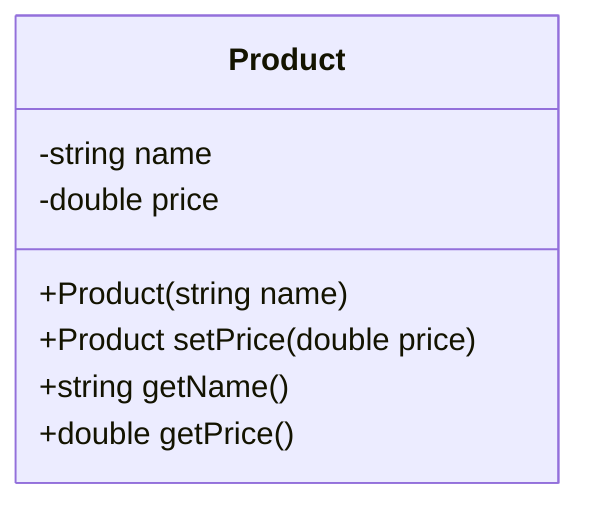
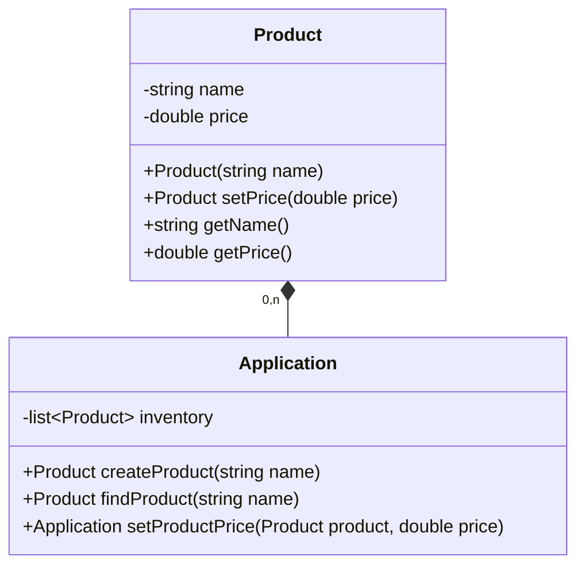
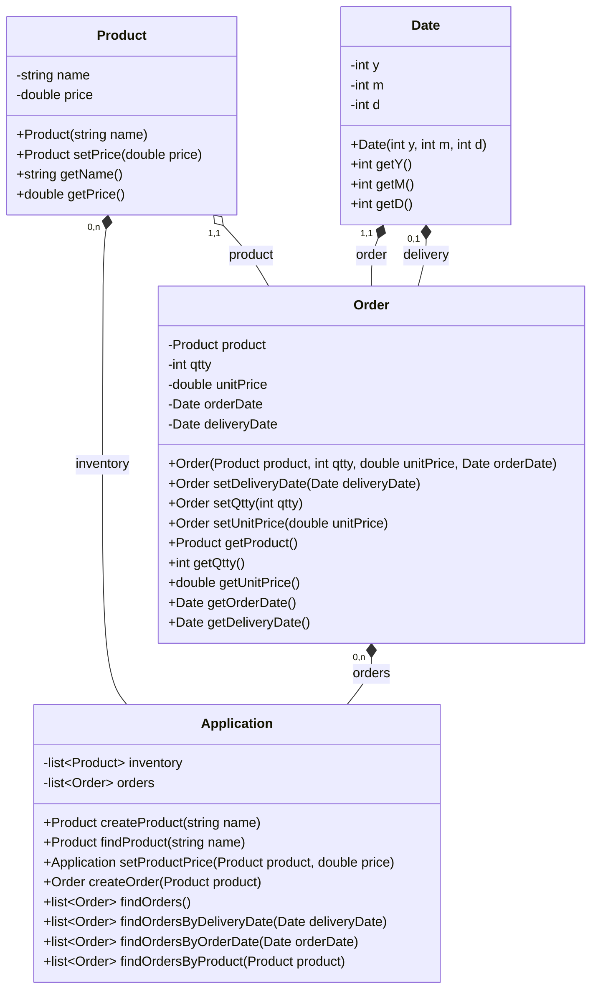

# 0. Contexte

L'objectif ici est surtout de s'entraîner en UML.
On va ici imaginer une application de gestion de commande de marchandises pour notre restaurateur favori (quel qu'il soit).

Il faut donc penser :
- aux produits
- à l'état du stock de ces produits
- aux commandes de produits
- à la gestion de l'application elle-même

Nous étendrons ces éléments par la suite.

> [!Note]
> Nous allons utiliser les types "primitifs" suivants : int, double, string, list

# 1. Classe Produit

La classe Produit sera réutilisée un peu partout.
Créez donc cette classe en UML, en gardant en tête les principes de base de l'OO (notemment SOLID).

> [!Tip]
> En UML, on ne distingue PAS référence/pointeur d'une copie.
> Un objet est un objet.
> La seule distinction qui pourrait se faire serait dans la nature des relations;
> une composition utiliserait certainement des objets "pleins" là où une agrégation conserverait des pointeurs.

Proposition de solution

# 2. Classe Application

Notre application va conserver un inventaire de produits, et va gérer l'affichage du menu principal, ainsi que préparer les différentes actions :
- ajout d'un produit
- recherche d'un produit par son nom
- modification du prix d'un produit

Modélisez donc cela en UML (attention à prendre en compte le lien avec `Product` !).

Proposition de solution

A partir de maintenant, il faudra penser à enrichier votre classe Application des différentes possibilités offertes.

# 3. Commandes

Notre application doit gérer les commandes.
Une commande concerne un seul produit, a une date de commande (obligatoire), une date de livraison (facultatif) ainsi qu'un prix unitaire et une quantité.
On doit pouvoir retrouver une liste de commandes à partir d'une date de commande, de livraison, ou d'un produit.

Proposition de solution

